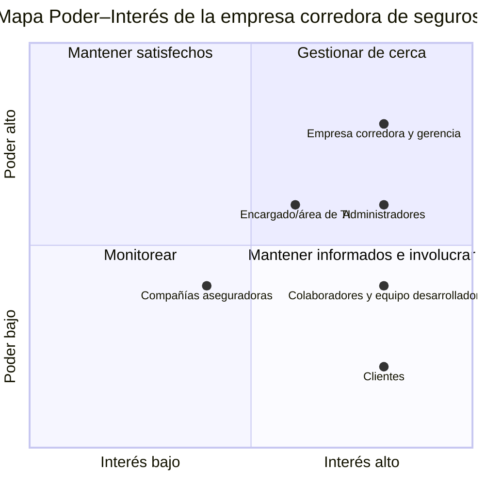

# Historial de versiones

Este historial registra los avances realizados cada semana durante el desarrollo del proyecto.

<table style="border-collapse: collapse; width: 100%; border-bottom: 2px solid currentColor;">
  <thead style="border-bottom: 2px solid currentColor;">
    <tr>
      <th>Versi&#243;n</th>
      <th>Semana</th>
      <th>Fecha</th>
      <th>Avance realizado</th>
    </tr>
  </thead>
  <tbody>
    <tr>
      <td>0.1</td>
      <td>2</td>
      <td>23/09/2026</td>
      <td>Documentaci&#243;n de la propuesta inicial: problema, sistema propuesto, roles, valor esperado y objetivos.</td>
    </tr>
    <tr>
      <td>0.2</td>
      <td>2</td>
      <td>Por definir</td>
      <td>Identificaci&#243;n de ocho interesados, registro (tabla) de necesidad, poder, inter&#233;s, actitud y estrategia, valoraci&#243;n del poder y el inter&#233;s y construcci&#243;n del mapa Poder–Inter&#233;s.</td>
    </tr>
    <tr>
      <td></td>
      <td></td>
      <td></td>
      <td></td>
    </tr>
  </tbody>
</table>

## Semana 2

**Tema:** Sistema de gestión y seguimiento de solicitudes de clientes para una empresa corredora de seguros.

**Estudiantes:**

- Seidy Alanis Balladares.
- Walbyn González Sequeira.

## 1. Planteamiento del problema

Una empresa corredora de seguros recibe diariamente solicitudes y consultas de sus clientes relacionadas con sus pólizas y servicios por diferentes medios, como llamadas telefónicas, correos electrónicos, presencial y WhatsApp. Al utilizar varios canales, se vuelve más difícil mantener las solicitudes organizadas y darles un seguimiento adecuado, debido a que no se cuenta con un mecanismo que permita conocer fácilmente el estado de cada solicitud, quién es el responsable y cuánto tiempo lleva siendo atendida.

Esta situación puede generar dificultades para llevar un control adecuado de las solicitudes y para disponer de información clara sobre el proceso de atención al cliente. Además, puede provocar retrasos, solicitudes repetidas o que algunos casos que requieren seguimiento no sean identificados oportunamente.

Por esta razón, surge la necesidad de analizar cómo se gestionan actualmente las solicitudes de los clientes, identificar las principales dificultades del proceso y buscar una alternativa que permita mejorar su organización, seguimiento y atención, tomando en cuenta las necesidades de los clientes y de las personas involucradas en el proceso.

## 2. Proyecto propuesto

Desarrollar un sistema web para la gestión y seguimiento de solicitudes de clientes de una empresa de seguros. El sistema permitirá centralizar en un solo lugar las solicitudes que actualmente pueden recibirse por diferentes medios, facilitando su registro, organización y seguimiento.

La propuesta contemplará el registro de cada solicitud con información como los datos del cliente, tipo de consulta o solicitud, fecha de ingreso, canal por el cual fue recibida, colaborador responsable, aseguradora responsable de atender, prioridad y estado. El colaborador que registre la solicitud quedará automáticamente asignado como responsable de su gestión. Los estados podrían incluir opciones como recibido, pendiente de requisito, enviado a aseguradora y finalizado, permitiendo conocer de manera rápida en qué situación se encuentra cada caso.

El sistema contará con dos roles principales:

### 2.1. Administrador

- Gestionar usuarios.
- Consultar el estado general de los trámites.
- Registrar solicitudes.
- Gestionar los trámites registrados.
- Actualizar los estados.
- Registrar observaciones o actualizaciones del trámite.
- Consultar y filtrar solicitudes para dar seguimiento.

### 2.2. Colaborador

- Registrar solicitudes.
- Gestionar los trámites registrados.
- Actualizar los estados.
- Registrar observaciones o actualizaciones del trámite.
- Consultar y filtrar solicitudes para dar seguimiento.

Además, el sistema permitirá consultar y filtrar las solicitudes para facilitar la búsqueda de casos específicos y dar seguimiento a aquellos que aún se encuentren pendientes. También se podrán registrar observaciones o actualizaciones realizadas durante la atención, de manera que exista un historial básico de cada solicitud.

La solución estará orientada a facilitar el trabajo de las personas encargadas de la atención al cliente, proporcionando una herramienta que permita mantener la información organizada, reducir la pérdida de seguimiento y disponer de información más clara sobre las solicitudes recibidas.

## 3. Valor esperado

Se espera que el sistema permita mejorar la organización y el seguimiento de las solicitudes de los clientes, centralizando la información en una sola plataforma y facilitando el control de cada trámite.

Con la implementación del sistema se espera:

- Mantener las solicitudes organizadas y centralizadas.
- Conocer el estado actual de cada trámite.
- Identificar fácilmente al colaborador responsable de cada solicitud.
- Facilitar el seguimiento de los trámites pendientes.
- Mantener un registro de las observaciones y actualizaciones realizadas.
- Facilitar la consulta y búsqueda de solicitudes mediante filtros.
- Reducir el riesgo de que una solicitud quede sin seguimiento.
- Proporcionar al administrador información general sobre el estado de los trámites.

## 4. Objetivos

### Objetivo general

Desarrollar un sistema web para la gestión y seguimiento de solicitudes de clientes de una empresa corredora de seguros, que facilite el registro, control y consulta de los trámites recibidos por los diferentes medios de atención.

### Objetivos específicos

1. Analizar el proceso actual de recepción y seguimiento de las solicitudes de los clientes, identificando las principales dificultades del proceso.

2. Definir los requerimientos del sistema web de acuerdo con las necesidades de los administradores y colaboradores.

3. Desarrollar un sistema web para el registro, gestión y seguimiento de las solicitudes de los clientes.

4. Implementar mecanismos de búsqueda y filtrado que faciliten la localización de solicitudes según diferentes criterios.

## Semana 2

### 1. Identificación de los interesados

- Empresa corredora de seguros.
- Gerencia de la corredora.
- Administradores.
- Colaboradores.
- Clientes de la corredora.
- Compañías aseguradoras.
- Equipo desarrollador.
- Encargado/área de TI.

### 2. Registro de interesados

Las actitudes y puntuaciones son estimaciones iniciales pendientes de validar. La existencia y las atribuciones del encargado o área de TI están por confirmar.

| Interesado | Rol / relación | Necesidad | Poder (1–5) | Interés (1–5) | Actitud | Estrategia |
| --- | --- | --- | --- | --- | --- | --- |
| 1. Empresa corredora de seguros | Organización donde se implementará el sistema y principal beneficiaria. | Centralizar las solicitudes y mejorar la continuidad de la atención. | 5 | 5 | Favorable. | Gestionar de cerca: validar el beneficio y la adecuación del sistema a sus procesos mediante sus representantes. |
| 2. Gerencia de la corredora | Autoriza decisiones, alcance y recursos del proyecto. | Conocer el avance y controlar el alcance y los recursos. | 5 | 5 | Favorable. | Gestionar de cerca: acordar prioridades y revisar avances semanalmente. |
| 3. Administradores | Utilizan el sistema y supervisan usuarios y trámites. | Gestionar usuarios y consultar el estado general de las solicitudes. | 4 | 5 | Favorable. | Gestionar de cerca: validar permisos, estados y consultas. |
| 4. Colaboradores | Utilizan diariamente el sistema para registrar y gestionar solicitudes. | Registrar y dar seguimiento a los casos sin duplicar trabajo. | 3 | 5 | Mixta: valoran el seguimiento, pero podrían percibir una mayor carga de registro. | Mantener informados e involucrar en pruebas de uso. |
| 5. Clientes de la corredora | Sus solicitudes serán gestionadas mediante el sistema. | Recibir atención y seguimiento oportunos. | 2 | 5 | Favorable. | Mantener informados y consultar sus necesidades de seguimiento. |
| 6. Compañías aseguradoras | Atienden trámites que la corredora gestiona para sus clientes. | Recibir solicitudes completas y atender correctamente los trámites remitidos. | 3 | 3 | Neutral. | Monitorear y consultar sus requisitos al definir el flujo de solicitudes. |
| 7. Equipo desarrollador | Diseña, desarrolla y documenta el sistema. | Contar con requisitos claros y un alcance viable. | 3 | 5 | Favorable. | Mantener informado e involucrar continuamente en las decisiones técnicas. |
| 8. Encargado/área de TI | Apoya la implementación, operación y soporte técnico. | Garantizar funcionamiento, seguridad y soporte. | 4 | 4 | Favorable, sujeto a la viabilidad técnica. | Gestionar de cerca: consultar restricciones técnicas y validar las condiciones de operación. |

### 3. Valoración del poder y el interés

Se utiliza la escala **1 = muy bajo, 2 = bajo, 3 = medio, 4 = alto y 5 = muy alto**.

- **Poder:** capacidad para autorizar, detener o modificar decisiones del proyecto.
- **Interés:** grado en que el resultado del proyecto afecta o importa al interesado.

Las puntuaciones del registro se justifican de la siguiente manera:

- **Empresa corredora de seguros — Poder 5, interés 5:** es la organización beneficiaria y determina si se implementa el sistema. Su autoridad se ejerce mediante sus representantes.
- **Gerencia de la corredora — Poder 5, interés 5:** autoriza recursos y decisiones de alcance, y necesita mejorar el control de las solicitudes. Se distingue de la empresa por su función de decisión; no representa una autoridad adicional independiente.
- **Administradores — Poder 4, interés 5:** aportan criterios para definir permisos, estados y supervisión de trámites. El sistema afecta directamente su trabajo.
- **Colaboradores — Poder 3, interés 5:** no se supone que aprueben recursos, pero su conocimiento y disposición a utilizar el sistema influyen en su adopción. Si también autorizan el proceso operativo, deberá revisarse su poder.
- **Clientes de la corredora — Poder 2, interés 5:** no deciden sobre el desarrollo, pero les importa recibir atención y seguimiento oportunos. Su interés alto no implica que tengan acceso directo al sistema.
- **Compañías aseguradoras — Poder 3, interés 3:** sus requisitos condicionan la atención de los trámites, aunque la propuesta no contempla modificar sus sistemas ni realizar integraciones. Si estas fueran necesarias, habría que aumentar o revisar su valoración.
- **Equipo desarrollador — Poder 3, interés 5:** propone soluciones y determina su viabilidad técnica, pero no aprueba por sí solo recursos o cambios de alcance. Su interés es muy alto porque es responsable de construir el sistema.
- **Encargado/área de TI — Poder 4, interés 4:** se supone que puede condicionar la implementación según la infraestructura y el soporte disponibles. Esta valoración debe confirmarse; si su función fuera únicamente consultiva, su poder sería menor.

### 4. Mapa Poder–Interés

El mapa ubica a los ocho interesados según las puntuaciones del registro. El **poder aumenta hacia arriba** y el **interés hacia la derecha**. Para formar los cuadrantes, se agrupan los valores **1 a 3 como bajos o medios** y los valores **4 a 5 como altos**. Los pares indican **(poder, interés)**.

Los interesados con la misma puntuación comparten un punto: empresa y gerencia **(5, 5)**; colaboradores y equipo desarrollador **(3, 5)**. Las posiciones conservan las puntuaciones del registro y el corte entre los niveles 3 y 4.

#### Interpretación

- **Empresa, gerencia, administradores y TI:** gestionar de cerca; validar decisiones, requisitos y avances.
- **Colaboradores, clientes y equipo desarrollador:** mantener informados e involucrar en consultas y validaciones según su función.
- **Compañías aseguradoras:** monitorear y consultar los requisitos de los trámites.
- **Mantener satisfechos:** no hay interesados en este cuadrante en la valoración inicial.

El mapa indica que se debe mantener una participación cercana con la empresa, la gerencia, los administradores y TI. Los colaboradores, clientes y desarrolladores requieren información y participación acorde con su relación con el sistema. Las aseguradoras se consultarán al definir los requisitos de los trámites. La representación de la empresa se coordinará con la gerencia para evitar duplicar la participación.
