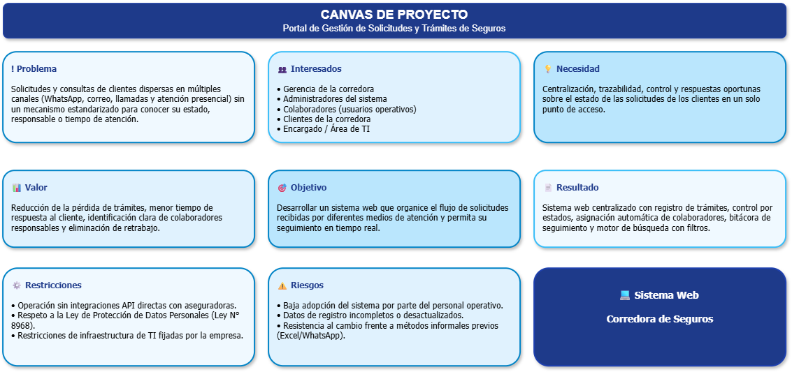
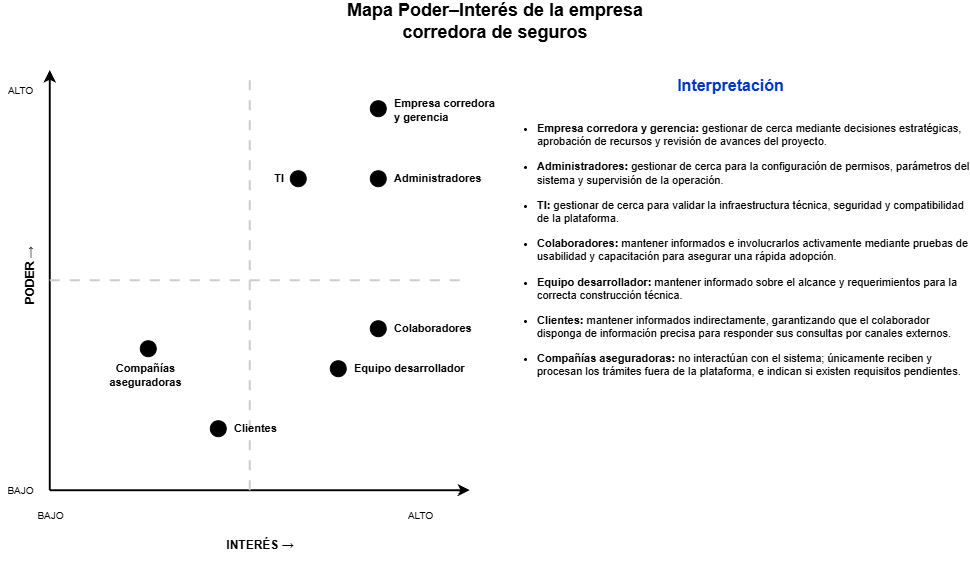

# Sistema de gestión y seguimiento de solicitudes de clientes para una empresa corredora de seguros

**Integrantes del equipo:**

- Seidy Alanis Balladares.
- Walbyn González Sequeira.

## Historial de versiones

Este historial registra los avances realizados cada semana durante el desarrollo del proyecto.

| Versión | Semana | Fecha | Avance realizado |
| --- | --- | --- | --- |
| 0.1 | 2 | 23/09/2026 | Documentación de la propuesta inicial: problema, sistema propuesto, roles, valor esperado y objetivos. |
| 0.2 | 2 | 26/09/2026 | Análisis de interesados (registro, mapa Poder–Interés e interesados críticos) y selección del Enfoque Híbrido de desarrollo.|
| 0.3 | 3 | 01/10/2026 | Definición del Scrum Team y distribución de responsabilidades de gestión, desarrollo, diseño, arquitectura y calidad. |
| 0.4 | 3 | 03/10/2026 | Incorporación acta de inicio, factores ambientales (EEFs) y diseño del Canvas del Proyecto |
| 0.5 | 4 | 10/10/2026 | Reorganización del documento basado en la guía para conformar el expediente. Además, incuye producto goal y etapas del cliclo de vida|

---

## Tabla de Contenidos

[Semana 1](#semana-1)

- [1. Acta de inicio (Project Charter)](#1-acta-de-inicio-project-charter)
  - [Planteamiento del problema](#planteamiento-del-problema)
  - [Proyecto propuesto](#proyecto-propuesto)
    - [Administrador](#administrador)
    - [Colaborador](#colaborador)
  - [Valor esperado](#valor-esperado)
  - [Objetivos](#objetivos)
    - [Objetivo general](#objetivo-general)
    - [Objetivos específicos](#objetivos-específicos)
  - [Alcance y límites generales](#alcance-y-límites-generales)
    - [Inclusiones (Dentro del Alcance)](#inclusiones-dentro-del-alcance)
    - [Exclusiones (Fuera del Alcance)](#exclusiones-fuera-del-alcance)

- [2. Product Goal](#2-product-goal)

- [3. Scrum Team](#3-scrum-team)
  - [Asignación de responsabilidades de Scrum](#asignación-de-responsabilidades-de-scrum)
  - [Distribución de funciones técnicas](#distribución-de-funciones-técnicas)

[Semana 2](#semana-2)

- [4. Contexto organizacional](#4-contexto-organizacional)
  - [Factores Ambientales de la Empresa (EEFs)](#factores-ambientales-de-la-empresa-eefs)
    - [Factores Internos](#factores-internos)
    - [Factores Externos](#factores-externos)
  - [Canvas del Proyecto](#canvas-del-proyecto)

- [5. Mapa de interesados](#5-mapa-de-interesados)
  - [Identificación de los interesados](#identificación-de-los-interesados)
  - [Registro de interesados](#registro-de-interesados)
  - [Valoración del poder y el interés](#valoración-del-poder-y-el-interés)
  - [Mapa Poder–Interés](#mapa-poderinterés)
  - [Interesados críticos](#interesados-críticos)

- [6. Restricciones](#6-restricciones)

[Semana 3](#semana-3)

- [1. Ciclo de vida del proyecto](#1-ciclo-de-vida-del-proyecto)
  - [Enfoque de Desarrollo del Proyecto](#enfoque-de-desarrollo-del-proyecto)
  - [Etapas del ciclo de vida](#etapas-del-ciclo-de-vida)

- [2. Primer Sprint](#2-primer-sprint)
    - [Plan del Sprint — Sprint #1](#plan-del-sprint--sprint-1)
      - [1. Información General](#1-información-general)
      - [2. Meta del Sprint (Sprint Goal)](#2-meta-del-sprint-sprint-goal)
      - [3. Sprint Backlog (Tareas de Análisis)](#3-sprint-backlog-tareas-de-análisis)
      - [4. Plan de Ejecución y Estrategia](#4-plan-de-ejecución-y-estrategia)
      - [5. Criterios de Aceptación Globales y Definición de Terminado (DoD)](#5-criterios-de-aceptación-globales-y-definición-de-terminado-dod)
    - [Eventos de Cierre del Sprint 1](#eventos-de-cierre-del-sprint-1)
      - [Revisión del Sprint (Sprint Review)](#revisión-del-sprint-sprint-review)
      - [Retrospectiva del Sprint (Sprint Retrospective)](#retrospectiva-del-sprint-sprint-retrospective)

---

## Semana 1

## 1. Acta de inicio (Project Charter)

Este borrador del Acta de Inicio reúne la justificación, los objetivos y los límites generales del proyecto.

### Planteamiento del problema

Una empresa corredora de seguros recibe diariamente solicitudes y consultas de sus clientes relacionadas con sus pólizas y servicios por diferentes medios, como llamadas telefónicas, correos electrónicos, presencial y WhatsApp. Al utilizar varios canales, se vuelve más difícil mantener las solicitudes organizadas y darles un seguimiento adecuado, debido a que no se cuenta con un mecanismo que permita conocer fácilmente el estado de cada solicitud, quién es el responsable y cuánto tiempo lleva siendo atendida.

Esta situación puede generar dificultades para llevar un control adecuado de las solicitudes y para disponer de información clara sobre el proceso de atención al cliente. Además, puede provocar retrasos, solicitudes repetidas o que algunos casos que requieren seguimiento no sean identificados oportunamente.

Por esta razón, surge la necesidad de analizar cómo se gestionan actualmente las solicitudes de los clientes, identificar las principales dificultades del proceso y buscar una alternativa que permita mejorar su organización, seguimiento y atención, tomando en cuenta las necesidades de los clientes y de las personas involucradas en el proceso.

### Proyecto propuesto

Desarrollar un sistema web para la gestión y seguimiento de solicitudes de clientes de una empresa corredora de seguros. El sistema permitirá centralizar en un solo lugar las solicitudes que actualmente pueden recibirse por diferentes medios, facilitando su registro, organización y seguimiento.

La propuesta contemplará el registro de cada solicitud con información como los datos del cliente, tipo de consulta o solicitud, fecha de ingreso, canal por el cual fue recibida, colaborador responsable, aseguradora responsable de atender, prioridad y estado. El colaborador que registre la solicitud quedará automáticamente asignado como responsable de su gestión. Los estados podrían incluir opciones como recibido, pendiente de requisito, enviado a aseguradora y finalizado, permitiendo conocer de manera rápida en qué situación se encuentra cada caso.

El sistema contará con dos roles principales:

#### Administrador

- Gestionar usuarios.
- Consultar el estado general de los trámites.
- Registrar solicitudes.
- Gestionar los trámites registrados.
- Actualizar los estados.
- Registrar observaciones o actualizaciones del trámite.
- Consultar y filtrar solicitudes para dar seguimiento.

#### Colaborador

- Registrar solicitudes.
- Gestionar los trámites registrados.
- Actualizar los estados.
- Registrar observaciones o actualizaciones del trámite.
- Consultar y filtrar solicitudes para dar seguimiento.

Además, el sistema permitirá consultar y filtrar las solicitudes para facilitar la búsqueda de casos específicos y dar seguimiento a aquellos que aún se encuentren pendientes. También se podrán registrar observaciones o actualizaciones realizadas durante la atención, de manera que exista un historial básico de cada solicitud.

La solución estará orientada a facilitar el trabajo de las personas encargadas de la atención al cliente, proporcionando una herramienta que permita mantener la información organizada, reducir la pérdida de seguimiento y disponer de información más clara sobre las solicitudes recibidas.

### Valor esperado

Se espera que el sistema permita mejorar la organización y el seguimiento de las solicitudes de los clientes, centralizando la información en una sola plataforma y facilitando el control de cada trámite.

Con la implementación del sistema se espera:

- Mantener las solicitudes organizadas y centralizadas.
- Conocer el estado actual de cada trámite.
- Identificar fácilmente al colaborador responsable de cada solicitud.
- Facilitar el seguimiento de los trámites pendientes.
- Mantener un registro de las observaciones y actualizaciones realizadas.
- Facilitar la consulta y búsqueda de solicitudes mediante filtros.
- Reducir el riesgo de que una solicitud quede sin seguimiento.
- Proporcionar al administrador información general sobre el estado de los trámites.

### Objetivos

#### Objetivo general

Desarrollar un sistema web para la gestión y seguimiento de solicitudes de clientes de una empresa corredora de seguros, que facilite el registro, control y consulta de los trámites recibidos por los diferentes medios de atención.

#### Objetivos específicos

1. Analizar el proceso actual de recepción y seguimiento de las solicitudes de los clientes, identificando las principales dificultades del proceso.

2. Definir los requerimientos del sistema web de acuerdo con las necesidades de los administradores y colaboradores.

3. Desarrollar un sistema web para el registro, gestión y seguimiento de las solicitudes de los clientes.

4. Implementar mecanismos de búsqueda y filtrado que faciliten la localización de solicitudes según diferentes criterios.

### Alcance y límites generales

Con base en la descripción y roles definidos en el [proyecto propuesto](#proyecto-propuesto), el alcance del proyecto comprende:

#### Inclusiones (Dentro del Alcance)

* **Gestión de solicitudes:** Registro de trámites ingresando datos del cliente, tipo de consulta, fecha, canal de ingreso, aseguradora responsable, prioridad y estado inicial.
* **Asignación automática:** El usuario que registra la solicitud queda asignado automáticamente como el colaborador responsable.
* **Seguimiento y bitácora:** Actualización de estados del trámite (*recibido, pendiente de requisito, enviado a aseguradora, finalizado*) y registro de observaciones/actualizaciones.
* **Búsqueda y filtrado:** Motor de búsqueda con filtros por diversos criterios para localizar casos y dar seguimiento a trámites pendientes.
* **Gestión de accesos y roles:**
  * **Colaborador:** Funciones operativas de registro, gestión de trámites, actualización de estados, observaciones y consultas con filtros.
  * **Administrador:** Acceso total a todas las funciones del sistema, consulta del estado general de las solicitudes y módulo para la gestión de usuarios.

#### Exclusiones (Fuera del Alcance)

* **Acceso a clientes finales:** El sistema es para uso exclusivo del personal interno de la corredora; no contempla usuarios ni portal de consulta para clientes externos.
* **Integraciones automáticas con aseguradoras o mensajería:** No incluye conexión API automatizada con sistemas de aseguradoras ni envío/recepción automática de mensajes (WhatsApp API, SMS, etc.).
* **Gestión financiera o de cobros:** No abarca facturación, pagos ni cobros de pólizas.

## 2. Product Goal

Centralizar el registro y el historial de solicitudes en una plataforma web que permita a administradores y colaboradores consultar el responsable y el estado actualizado de cada trámite registrado, para reducir el riesgo de que los casos pendientes queden sin seguimiento.

## 3. Scrum Team

El Scrum Team está conformado por Seidy Alanis y Walbyn González. Durante las semanas establecidas del proyecto, ambos integrantes participarán en el desarrollo del sistema web de gestión y seguimiento de solicitudes de clientes de la empresa corredora de seguros. Debido a que el equipo cuenta con dos integrantes, cada persona combinará responsabilidades.

### Asignación de responsabilidades de Scrum

| Responsabilidad | Integrante asignado | Funciones principales |
| --- | --- | --- |
| **Product Owner** | Seidy Alanis | Definir el objetivo del producto; mantener actualizada la lista de tareas pendientes del producto; aclarar los requisitos de registro, seguimiento y consulta de solicitudes con los interesados; revisar que las funcionalidades respondan a las necesidades del negocio. |
| **Scrum Master** | Walbyn González | ofrecerá asesoramiento sobre los procesos y metodologías al propietario del producto, a los desarrolladores y a las partes interesadas. Además, actúa como agente de cambio y facilita el desarrollo organizacional. |
| **Developers** | Seidy Alanis y Walbyn González | Planificar el trabajo de cada Sprint; analizar, diseñar, desarrollar y probar las funcionalidades; integrar los componentes del sistema y cumplir los criterios de calidad acordados en la Definición de Terminado. |

### Distribución de funciones técnicas

Ambos integrantes participarán como desarrolladores full-stack, con una distribución inicial de funciones principales y apoyo mutuo según las necesidades de cada Sprint.

| Función técnica | Responsable principal | Actividades en el proyecto |
| --- | --- | --- |
| **Desarrollo full-stack** | Ambos | Construir e integrar las interfaces, la lógica del sistema y el acceso a la base de datos; corregir errores y entregar funcionalidades completas. |
| **Frontend** | Seidy Alanis, con apoyo de Walbyn González | Implementar las pantallas de registro, consulta y seguimiento de solicitudes, filtros y formularios; adaptar las interfaces a distintos dispositivos. |
| **Backend** | Walbyn González, con apoyo de Seidy Alanis | Implementar la lógica de solicitudes, cambios de estado, asignación de responsables, observaciones, autenticación y permisos de Administrador y Colaborador. |
| **Designer** | Seidy Alanis | Elaborar bocetos y prototipos; definir la apariencia y navegación; validar la facilidad de uso de las pantallas con los colaboradores. |
| **Architect** | Walbyn González | Proponer y documentar la estructura del sistema, los componentes, el modelo de datos y las tecnologías; acordar las decisiones técnicas con el equipo considerando las restricciones de infraestructura. |
| **QA** | Ambos | Definir criterios de aceptación; diseñar y ejecutar pruebas de registro, filtros, estados y permisos; registrar defectos y comprobar sus correcciones. |
| **Documentación técnica** | Ambos | Mantener actualizados los requisitos, las decisiones técnicas, los resultados de pruebas y las instrucciones de uso del sistema. |

## Semana 2

## 4. Contexto organizacional

Una empresa corredora de seguros recibe diariamente solicitudes y consultas de sus clientes relacionadas con sus pólizas y servicios por diferentes medios, como llamadas telefónicas, correos electrónicos, presencial y WhatsApp. Al utilizar varios canales, se vuelve más difícil mantener las solicitudes organizadas y darles un seguimiento adecuado, debido a que no se cuenta con un mecanismo que permita conocer fácilmente el estado de cada solicitud, quién es el responsable y cuánto tiempo lleva siendo atendida.

### Factores Ambientales de la Empresa (EEFs)

Los Factores Ambientales de la Empresa son condiciones internas y externas que no están bajo el control directo del equipo de desarrollo, pero que influyen, condicionan y orientan las decisiones del proyecto.

#### Factores Internos

* **Cultura operacional y canales dispersos:** La corredora atiende clientes por teléfono, correo, WhatsApp y presencialmente sin un flujo estandarizado. El sistema debe adaptarse a esta realidad multi-canal para facilitar su adopción.
* **Infraestructura de TI:** La elección de tecnologías, el servidor de alojamiento (*hosting*) y la base de datos deberá ajustarse a la infraestructura disponible y a las condiciones que se confirmen con la empresa.
* **Estructura organizacional:** Definición clara de permisos y roles de trabajo (Administrador y Colaborador) según las funciones de la empresa.

#### Factores Externos

* **Normativa legal y privacidad:** Manejo de datos sensibles de clientes y pólizas sujeto a la legislación vigente de protección de datos personales (*Ley N° 8968*).
* **Entorno con Aseguradoras:** Las compañías aseguradoras operan con sus propias plataformas y tiempos. El sistema registrará el envío del trámite a la aseguradora correspondiente sin requerir integraciones API directas.
* **Expectativas de los clientes:** Los clientes no interactúan con el sistema, pero esperan respuestas rápidas cuando consultan a su colaborador por los canales tradicionales.

---

### Canvas del Proyecto

El Canvas del Proyecto sintetiza los aspectos fundamentales de gobernanza, alcance, interesados y restricciones para el desarrollo del sistema de gestión de solicitudes de la Corredora de Seguros:

## 5. Mapa de interesados

### Identificación de los interesados

- Empresa corredora de seguros.
- Gerencia de la corredora.
- Administradores.
- Colaboradores.
- Clientes de la corredora.
- Compañías aseguradoras.
- Equipo desarrollador.
- Encargado/área de TI.

### Registro de interesados

Las actitudes y puntuaciones son estimaciones iniciales pendientes de validar. La existencia y las atribuciones del encargado o área de TI están por confirmar.

| Interesado | Rol / relación | Necesidad | Poder (1–5) | Interés (1–5) | Actitud | Estrategia |
| --- | --- | --- | --- | --- | --- | --- |
| 1. Empresa corredora de seguros | Organización donde se implementará el sistema y principal beneficiaria. | Centralizar las solicitudes y mejorar la continuidad de la atención. | 5 | 5 | Favorable. | Gestionar de cerca: validar el beneficio y la adecuación del sistema a sus procesos mediante sus representantes. |
| 2. Gerencia de la corredora | Autoriza decisiones, alcance y recursos del proyecto. | Conocer el avance y controlar el alcance y los recursos. | 5 | 5 | Favorable. | Gestionar de cerca: acordar prioridades y revisar avances semanalmente. |
| 3. Administradores | Gestionan usuarios, definen permisos y supervisan el flujo general de los trámites. | Gestionar usuarios, configurar roles y consultar el estado general de las solicitudes. | 4 | 5 | Favorable. | Gestionar de cerca: validar permisos, estados y consultas. |
| 4. Colaboradores | Registran y gestionan diariamente las solicitudes recibidas por los diversos canales. | Registrar y dar seguimiento a los casos sin duplicar trabajo. | 3 | 5 | Mixta: valoran el seguimiento, pero podrían percibir una mayor carga de registro. | Gestionar de cerca: consultar sus requerimientos de captura, validar la facilidad de las pantallas y capacitarlos en el uso del sistema. |
| 5. Clientes de la corredora | Beneficiarios externos; consultan el avance de sus trámites por medios tradicionales (llamadas, mensajes) sin acceso al sistema. | Recibir atención y seguimiento oportunos sobre sus solicitudes. | 2 | 3 | Favorable. | Mantener informados: asegurar que el sistema brinde datos precisos y actualizados para que el colaborador les responda con rapidez. |
| 6. Compañías aseguradoras | Entidades externas; reciben las solicitudes canalizadas por la corredora mediante sus propias plataformas oficiales. | Recibir la información completa para tramitar las solicitudes en sus plataformas. | 3 | 2 | Neutral. | Monitorear y consultar sus requisitos al definir el flujo de solicitudes. |
| 7. Equipo desarrollador | Diseña, desarrolla y documenta el sistema. | Contar con requisitos claros y un alcance viable. | 3 | 5 | Favorable. | Mantener informado e involucrar continuamente en las decisiones técnicas. |
| 8. Encargado/área de TI | Apoya la implementación, operación y soporte técnico. | Garantizar funcionamiento, seguridad y soporte. | 4 | 4 | Favorable, sujeto a la viabilidad técnica. | Gestionar de cerca: consultar restricciones técnicas y validar las condiciones de operación. |

### Valoración del poder y el interés

Se utiliza la escala **1 = muy bajo, 2 = bajo, 3 = medio, 4 = alto y 5 = muy alto**.

- **Poder:** capacidad para autorizar, detener o modificar decisiones del proyecto.
- **Interés:** grado en que el resultado del proyecto afecta o importa al interesado.

Las puntuaciones del registro se justifican de la siguiente manera:

- **Empresa corredora de seguros — Poder 5, interés 5:** es la organización beneficiaria y determina si se implementa el sistema. Su autoridad se ejerce mediante sus representantes.
- **Gerencia de la corredora — Poder 5, interés 5:** autoriza recursos y decisiones de alcance, y necesita mejorar el control de las solicitudes. Se distingue de la empresa por su función de decisión; no representa una autoridad adicional independiente.
- **Administradores — Poder 4, interés 5:** aportan criterios para definir permisos, estados y supervisión de trámites. El sistema afecta directamente sus tareas de control.
- **Colaboradores — Poder 3, interés 5:** son los usuarios operativos clave encargados de ingresar la información. Aunque no aprueban recursos, su disposición a utilizar el sistema determina su adopción y éxito operativo.
- **Clientes de la corredora — Poder 2, interés 3:** no interactúan con el sistema ni poseen usuarios en la plataforma. Su interés es medio ya que se enfoca en recibir respuestas oportunas a través de las consultas que realicen al colaborador por los canales tradicionales (llamadas, WhatsApp, correo o presencial).
- **Compañías aseguradoras — Poder 3, interés 2:** operan de forma independiente a la plataforma y reciben las solicitudes por sus propios canales oficiales, por lo que no interactúan con el software de la corredora.
- **Equipo desarrollador — Poder 3, interés 5:** propone soluciones y determina su viabilidad técnica, pero no aprueba por sí solo recursos o cambios de alcance. Su interés es muy alto porque es responsable de construir el sistema.
- **Encargado/área de TI — Poder 4, interés 4:** se supone que puede condicionar la implementación según la infraestructura y el soporte disponibles. Esta valoración debe confirmarse; si su función fuera únicamente consultiva, su poder sería menor.

### Mapa Poder–Interés

El mapa ubica a los ocho interesados según las puntuaciones del registro. El **poder aumenta hacia arriba** y el **interés hacia la derecha**. Para formar los cuadrantes, se agrupan los valores **1 a 3 como bajos o medios** y los valores **4 a 5 como altos**. Los pares indican **(poder, interés)**.

### Interesados críticos

Basado en el mapa de poder-interés se determinan tres interesados críticos y cómo se involucrarán. 

#### **- Gerencia de la corredora (Alto poder y alto interés)**

Autoriza recursos, aprueba el alcance y requiere visibilidad del control de solicitudes.

**Involucramiento:** 

- Reuniones semanales de avance y demostraciones funcionales. 
- Validar el flujo de estados de solicitudes, revisar avances del cronograma y aprobar las entregas de cada etapa. 

#### **- Colaboradores (Bajo poder y alto interés)**

Son los usuarios operativos finales que ingresan las solicitudes; su adopción determina el éxito del sistema.

**Involucramiento:** 

- Sesiones bisemanales de diseño y pruebas continuas de usabilidad.
- Validar prototipos de las pantallas de registro, simplificar la actualización de estados e impartir capacitaciones del uso de la plataforma.

#### **- Encargado/área de TI (Alto poder y alto interés)**

Si se confirma su existencia y autoridad, participará en la validación de la factibilidad técnica, las condiciones de infraestructura y la seguridad de la información.

**Involucramiento:** 

- Mesas de trabajo técnicas al inicio, a mitad del desarrollo y previo al despliegue.
- Acordar el servidor de alojamiento, definir la gestión de base de datos y respaldos, e implementar mecanismos seguros de autenticación.

## 6. Restricciones

* **Infraestructura de TI:** La elección de tecnologías, el servidor de alojamiento (*hosting*) y la base de datos deberá ajustarse a la infraestructura disponible y a las condiciones que se confirmen con la empresa.
* **Acceso a clientes finales:** El sistema es para uso exclusivo del personal interno de la corredora; no contempla usuarios ni portal de consulta para clientes externos.
* **Integraciones automáticas con aseguradoras o mensajería:** No incluye conexión API automatizada con sistemas de aseguradoras ni envío/recepción automática de mensajes (WhatsApp API, SMS, etc.).
* **Gestión financiera o de cobros:** No abarca facturación, pagos ni cobros de pólizas.

---

## Semana 3

## 1. Ciclo de vida del proyecto

### Enfoque de Desarrollo del Proyecto

Debido a las características del proyecto, se requerirá un enfoque híbrido, combinando la previsibilidad y el control de la gestión predictiva con la flexibilidad e iteración de la gestión adaptativa:

**Predictivo (Control, Arquitectura y Reglas de Negocio):** Se empleará para definir formalmente la base del sistema antes del desarrollo masivo. Permitirá establecer la arquitectura de base de datos, las restricciones de infraestructura que se confirmen con la empresa (seguridad, autenticación y respaldos) y la matriz formal de roles y permisos (Administrador vs. Colaborador). Esto facilitará el cumplimiento de las reglas del negocio y el control del alcance, tiempo y presupuesto.

**Adaptativo (Desarrollo incremental del sistema):** Se aplicará mediante ciclos iterativos (sprints) para construir e integrar las interfaces, la lógica de negocio y el almacenamiento de datos, con pruebas de las funcionalidades. Debido a que las solicitudes ingresarán por múltiples canales (WhatsApp, correo, llamadas y atención presencial), la capa visual se validará de forma incremental con los Colaboradores. Esto permitirá ajustar filtros, botones y vistas para optimizar la usabilidad y facilitar la adopción del sistema.

En conclusión, el componente predictivo asegurará la gobernanza, la seguridad y los permisos de acceso del sistema, mientras que el componente adaptativo otorgará la flexibilidad necesaria para diseñar e iterar las pantallas web a la medida de la operación diaria de los colaboradores.

### Etapas del ciclo de vida

| Etapa | Trabajo y resultado esperado |
| --- | --- |
| Inicio | Definir el problema, la propuesta, el Product Goal y el equipo. |
| Análisis inicial — Sprint 1 | Revisar la idea, los roles, los datos y las reglas del sistema para preparar el Product Backlog inicial. |
| Desarrollo incremental — Sprints 2 a 5 | Seleccionar trabajo del backlog y construir, integrar, probar y revisar funcionalidades. La distribución se definirá al priorizar el backlog. |
| Entrega y cierre | Consolidar el expediente, el informe final y la demostración del sistema. |

El análisis inicial se ejecuta como el primer sprint dentro de los cinco sprints contemplados en el proyecto. Tal como establece la dinámica metodológica, es necesario iniciar este ciclo de trabajo para analizar la idea del negocio antes de disponer de la lista definitiva de requerimientos (Product Backlog).

## 2. Primer Sprint 

**Estado:** Sprint finalizado y completado.

### Plan del Sprint — Sprint #1

#### 1. Información General
* **Nombre del Sprint:** Sprint 1 — Análisis de Requerimientos y Reglas de Negocio
* **Fecha de Inicio:** 30/09/2026 (Semana 3)
* **Fecha de Fin:** 07/10/2026 (Semana 4)
* **Duración:** 1 semana
* **Capacidad del Equipo:** 2 personas (Seidy Alanis y Walbyn González) / ~40 horas totales (11 SP)

#### 2. Meta del Sprint (Sprint Goal)
> Analizar la problemática de atención de solicitudes en la corredora de seguros y definir la estructura inicial del sistema para preparar la lista de requerimientos que conformará el Product Backlog.

#### 3. Sprint Backlog (Tareas de Análisis)

| ID | Historia de Usuario / Tarea | Estimación | Responsable |
| :--- | :--- | :---: | :--- |
| **TASK-01** | **Análisis del Problema:** Estudio de la recepción dispersa de solicitudes (WhatsApp, correo, llamadas, presencial) para definir la centralización del trámite. | **3 SP** | Seidy Alanis |
| **TASK-02** | **Definición de Campos:** Identificación de los 8 datos del registro (*cliente, consulta, fecha, canal, aseguradora, prioridad, estado y responsable*). | **3 SP** | Seidy Alanis |
| **TASK-03** | **Roles y Asignación:** Definición de la matriz de permisos (*Administrador vs. Colaborador*) y la regla de asignación automática del responsable. | **3 SP** | Walbyn González |
| **TASK-04** | **Flujo de Estados:** Propuesta y documentación del flujo de estados (*recibido, pendiente de requisito, enviado a aseguradora, finalizado*). | **2 SP** | Walbyn González |

#### 4. Plan de Ejecución y Estrategia
* **Arquitectura/Diseño:** Análisis conceptual y diagramación del flujo de datos multi-canal. Definición del modelo de datos preliminar, entidad de solicitudes y matriz de roles.
* **Dependencias:** Requisito previo de recopilación de información operativa inicial efectuada durante la propuesta del proyecto.
* **Riesgos Identificados:** Ambigüedad en la obligatoriedad y formatos de entrada para cada campo de la solicitud.

#### 5. Criterios de Aceptación Globales y Definición de Terminado (DoD)
Para considerar este Sprint de análisis como Terminado, se debió cumplir con:
* Especificación completa de los 8 datos clave de la solicitud y su tipo de asignación (manual vs. automática).
* Matriz de permisos funcionales entre los roles de Administrador y Colaborador definida.
* Regla de negocio de asignación automática formalmente documentada.
* Documento de especificación de requerimientos revisado y validado por la Product Owner.

### Eventos de Cierre del Sprint 1

#### Revisión del Sprint (Sprint Review)
* **Fecha de realización:** Cierre de la Semana 3 / Inicio de la Semana 4.
* **Participantes:** Seidy Alanis (Product Owner / Developer) y Walbyn González (Scrum Master / Developer).
* **Evaluación de entregables y Criterios de Aceptación:**
  * **Verificación:** Se revisó la especificación de los ocho datos clave del registro (*cliente, tipo de consulta, fecha de ingreso, canal de recepción, aseguradora, prioridad, estado y responsable automático*).
  * **Roles y Permisos:** Se verificó y aprobó la matriz funcional de accesos entre Administrador y Colaborador.
  * **Flujo de estados:** Se validaron preliminarmente los cuatro estados del trámite (*recibido, pendiente de requisito, enviado a aseguradora y finalizado*).
  * **Resultado:** El incremento analítico fue revisado, comprobado contra los criterios de aceptación y aprobado por la Product Owner. El entregable queda oficialmente aceptado para estructurar el Product Backlog en la Semana 4.

#### Retrospectiva del Sprint (Sprint Retrospective)
* **¿Qué funcionó bien?**
  * La comunicación constante y fluida entre Seidy y Walbyn facilitó la toma de decisiones rápidas en la definición de permisos y reglas del negocio.
  * La combinación de roles de Scrum con responsabilidades de desarrollo Full-Stack se adaptó adecuadamente a la estructura de un equipo de dos personas.
* **¿Qué se puede mejorar?**
  * Definir con un mayor nivel de detalle las validaciones de entrada, formatos exactos y obligatoriedad de campos antes de iniciar con la programación de interfaces.
* **Compromiso de mejora para el Sprint 2:**
  * Redactar Criterios de Aceptación detallados y especificaciones claras de validación de datos en cada Historia de Usuario dentro del Product Backlog.